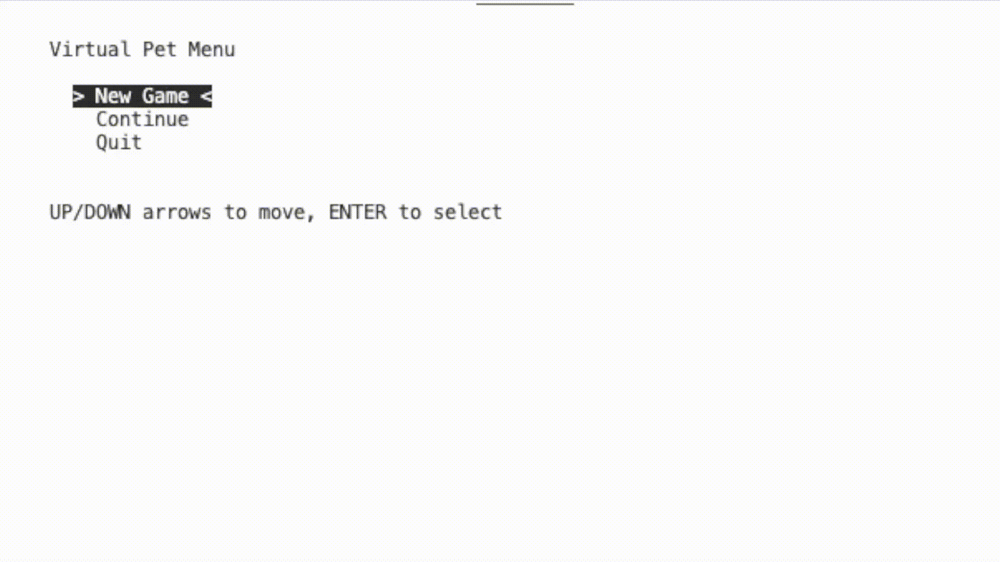

# Tamagotchi Game

This is an adaptation terminal based tamagotchi game written in C using the ncurses library. 
Player can create, save, load, and interact with a virtual pet.

---

## Features

* [ ] Create a new pet
* [ ] Save game progress
* [ ] Load existing game
* [ ] Feed pet
* [ ] Play a guessing minigame
* [ ] Pet statistics (hunger, happiness, energy)
* [ ] Ncurses menu navigation
* [ ] Recharge pets energy

---

## Technologies

* C
* ncurses
* GCC

---

## Installation

### Requirements

* GCC compiler
* ncurses library

### Compile and run
Open the terminal, copy and paste:
```bash
gcc *.c -lncurses -o main
./main
```
---

## Controls

| Key           | Action        |
| ------------- | ------------- |
| ↑             | Move up       |
| ↓             | Move down     |
| ←             | Move left     |
| →             | Move right    |
| Enter         | Select option |

---

## How It Works

1. User starts the program.
2. Main menu appears.
3. User selects:

   * New Game
   * Continue Game
   * Quit
4. The game screen is displayed.
5. User interacts with the pet.
6. Progress can be saved and loaded.

---

## Challenges and Lessons Learned

I would say this game is still in progress, there are a lots of cool features that can be added or improved. There might be bugs to be tested/checked.
The main purpose of this project was for me to get familiar with the C syntax, this was a very fun and instructive challenge.
The hardest thing was having to learn and work with ncurses simultaneously as I was also learning how to work with C and its syntax, which is the main reason why this took me longer time to finish (this first draft at least) than i had planned, but there are no regrets.

---

## Future Improvements

* [ ] Multiple pets
* [ ] Feeding options + not filling up the hunger bar to 100 right away
* [ ] Pet evolution + aging
* [ ] Pet dying if not taken well cared
* [ ] More minigames
* [ ] Improve the whole sleeping feature
      
---
## Demo

